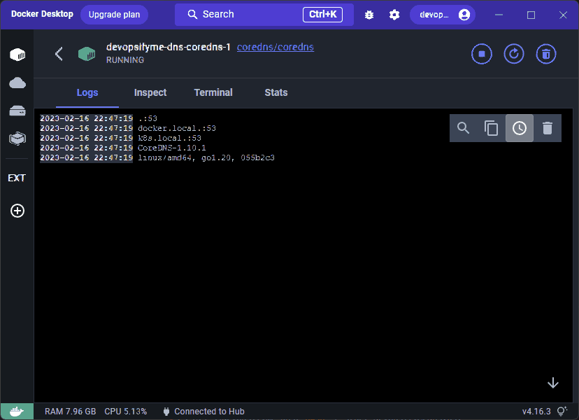

# DevOpsifyMe - DNS
Utility scripts allowing to 'replace' /etc/hosts with your own CoreDNS server on Docker. **There is NO NEED to override DNS servers on the network adapter anymore!**
* CoreDNS will serve two preconfigured zones *.k8s.local and *.docker.local by default
* CoreDNS will forward all other DNS requests to the discovered name servers from your active adapters DHCP, or VPN, or static.  
* You have full access to CoreDNS configuration and plugins
* If CoreDNS is not running, OS will simply skip it (no more lost network connectivity)

Note that configuration is reloaded automatically when any WiFi/Cable/VPN network is connected/disconnected, so there is no need to manually update DNS servers - it is supposed to be transparent once active :)



## Main use cases 

* Support for wildcard DNS records (*) - think Kubernetes ingress
* Support for any DNS record type during development (not only A/AAAA with /etc/hosts)
* Serve records from cloud DNS (Azure, AWS, Google Cloud), that are not yet connected to public DNS
* Override existing, public DNS zones for testing purposes

## Prerequisites
* Git - to download the files
* Docker Desktop - to run CoreDNS
* PowerShell 7 - to run scripts
* Hyper-V - to create virtual network adapter

## Installation


```sh
# Get all the files
git clone https://github.com/piotr-rojek/devopsifyme-dns.git

# Register Virtual Network Adapter
# Run as administrator
pwsh -c ./Register-DevOpsifyMeDns.ps1

# Start the DNS server on Docker
pwsh -c ./Start-DevOpsifyMeDns.ps1

# Test - you should get 127.0.0.1 in response
netstat test.k8s.local
```

Go to Docker Desktop, and see CoreDNS logs to verify if there is traffic coming in.

## Configuration


Edit /config/Corefile and/or the zone configuration files, afterwards run Start-DevOpsifyMeDns.ps1 to apply.
* Sample zone configuration file can be found here https://en.wikipedia.org/wiki/Zone_file#Example_file.
* Go to https://coredns.io/ to read more about possibilities with CoreDNS